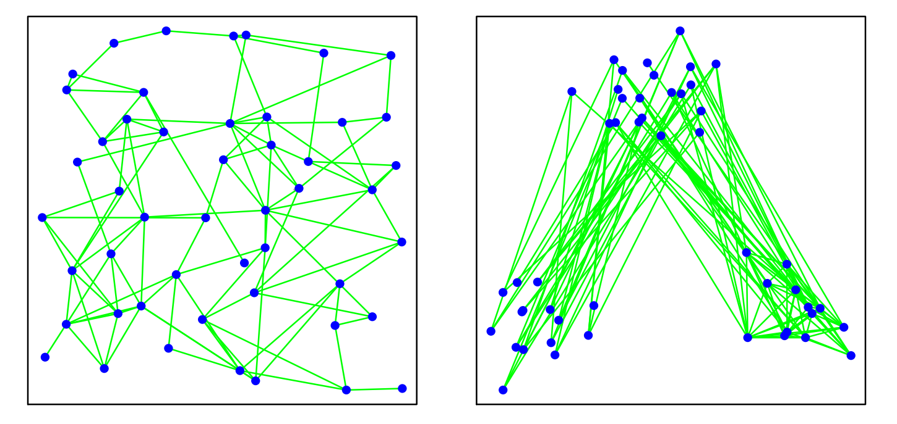

```{r setup, echo=FALSE, message=FALSE}
# These options are tuned for manuscript/presentation.
# They basically run R in the background except for spitting out figures/tables

knitr::opts_chunk$set(
	echo = FALSE,
	error = FALSE,
	message = FALSE,
	warning = FALSE
)

library(amen)
library(xergm.common)
library(network)
library(statnet)
library(kableExtra)
library(tidyverse)
data("alliances")
set.seed(42)

```

```{r output_help, include=FALSE}
# Modified summary function of amen package to output a table easier to handle
table_ame <- function(object, ...){ 
  fit <- object
  tmp <- cbind(
    apply(fit$BETA, 2, mean), apply(fit$BETA, 2, sd),
    
    2 * (1 - pnorm(abs(apply(fit$BETA, 2, mean) / apply(fit$BETA, 2, sd))))
  )
  colnames(tmp) <- c("pmean", "psd", "p - value")
  out <- round(tmp, 3)
  
  
  tmp <- cbind(apply(fit$VC, 2, mean), apply(fit$VC, 2, sd))
  tmp <- cbind(round(tmp, 3), array(" ", dim = c(nrow(tmp), 1)))

  out <- rbind(out, tmp)
  return(out)
} 
```

```{r models}
fitZNII0H <- readRDS(file = "models/fitZNII0H.rds") # AME R=2
fitCPLTUK <- readRDS(file = "models/fitCPLTUK.rds") # Additive Effects
fitX7XDFO <- readRDS(file = "models/fitX7XDFO.rds") # Multiplicative Effects R = 2
fitDASD8R <- readRDS(file = "models/fitDASD8R.rds") # No Effects
```

```{r modelsextended}
fitGIPKVP <- readRDS(file = "models/fitGIPKVP.rds") # AME Drop all non significant 
fitRU7J8K <- readRDS(file = "models/fitRU7J8K.rds") # AME quadruble iterations
```

# Introduction


## Networks in Economics and Political Science

- Networks are ubiquitous in Social Science applications. 
- Possible Research Questions: 
    - Network statistics as reciprocity, number of communities, etc..
    - Estimate structural parameters, including associated uncertainty. 
    - Identify drivers of longitudinal changes in networks.

\bigskip
Nomenclature

- Vertices or Nodes, named actors in a network.
- Edges, Dyads or ties, the relationship between two actors.
    - Can be valued, ordered, or binary. As well as directed or undirected. 


## Statistical Point of View
Consider the set of dyadic observations for the actors $1, \dots, n$:
$$\{ y_{ij}: 1 \leq i, j \leq n, \: i \neq j\}$$
where $y_{ij}$ is the observed (valued) relationship from actor $i$ to $j$. It can be written as a *sociomatrix* $Y \in \mathbb{R}^{n \times n}$, i.e.,
$$ Y := 
\begin{bmatrix}
NA & y_{12} & \cdots & y_{1n} \\
y_{21} & NA & \cdots & \cdots \\
\cdots & \cdots & \cdots &  y_{n-1 \: n}\\
y_{n1} & \cdots & y_{n\: n-1} & NA
\end{bmatrix}.
$$


**Note:** There is *a priori* no reason to assume (conditional) independence of the observations $y_{ij}$!


## Network Effects in Dyadic Data
*First-order network effects*

- Actor-specific heterogeneity to send or receive ties in the network. 

*Second-order network effects*

- Dyad-level network effects. Reciprocity, for example. 
  
*Third-order network effects* 

- Triad-level network effects. Balance, Transitivity and Clustering, for example. 
- Commonly described by proverbs: 
    - *my friends' friend is also my friend*, and 
    - *the enemy of my enemy is my friend*.


## Implications for Statistical Modeling 

**Issue:** We cannot assume (conditional) independence of observations in the presence of statistical network effects. Ordinary Regression approaches will yield biased estimates.

\bigskip
**Solution:** Capture statistical network effects in an extended error component of a generalized linear model. In Bayesian fashion done in the AME framework.


## AME Applications in Social Science

The AME framework has been applied to a variety of problems in the social sciences:

- @violenceNetworks study the implications of Boko Haram entering the Nigerian civil conflict.
- @ameSyria apply the AME network model on the Syrian civil conflict.
- @Minhas_Hoff_Ward_2016 use a VAR extension to model international relations.
- @dynamicAMEN present a longitudinal extension to the AME framework to study UN voting patterns over time.


# Theory

## Network Statistics

*First-order effects* 

Let $\{ \mu_i: \: 1, \dots, n\}$ be the the set of rowmeans, $\{ \eta_i: \: 1, \dots, n\}$ of columnmeans^[Undefined (NA) observations are dropped.]. Then,
$$sd.rowmean(Y) = \frac{1}{n} \sum^{n}_{i = 1} \left( \mu_i - \bar{\mu_i} \right)^2 \text{, and   } sd.colmean(Y) = \frac{1}{n} \sum^{n}_{i = 1} \left( \eta_i - \bar{\eta_i} \right)^2.$$
Note: Presence of actor-specific heterogeneity can also be tested using an ordinary ANOVA F-test for comparison of group means. 

---

*Second-order effects*

Reciprocity in the network can be described by the correlation of the relationship between actor $i$ and $j$, to the relationship of actor $j$ to $i$, if $i \neq j$. Then,^[Here, $vec(A)$ is a $m n \times 1$ column vector, which is obtained by stacking the columns of $A \in \mathbb{R}^{n \times m}$ on top of another.]
$$dyadic.dependency(Y) = corr\left( vec(Y), vec\left( Y^T \right) \right).$$
Naturally, for an undirected network dyadic dependency is 1. 

---

*Third-order effects* 

are patterns among three nodes. Let $E = Y - \bar{Y}$. Then,
$$cycle.dependency(Y) = \frac{1}{n (n-1) (n-2)} \sum_{i \neq j \neq k \neq i} E_{ij} E_{jk} E_{ki},$$
$$trans.dependency(Y) = \frac{1}{n (n-1) (n-2)} \sum_{i \neq j \neq k \neq i} E_{ij} E_{jk} E_{ik}.$$
Naturally, for an undirected network cycle dependency equals transitive dependency. Optionally the statistics can be standardized with $sd(vec(Y))^3$.

Alternatively, $E$ can be defined as the residual of an ordinary regression.

## Starting Point: A Generalized Linear Regression

Let,  
$$
\begin{aligned}
\mu_{ij} &= \mathbb{E}(y_{ij}) = h(\theta_{ij}) \\
\theta_{ij} &= \boldsymbol{\beta}^T \mathbf{x}_{ij}
\end{aligned}
$$
where $h$ is an invertible response function, $g = h^{-1}$ the link function. Assuming a normal density for the conditional distribution, we yield the identity as link, i. e., $\mu_{ij} = \theta_{ij}$ and:

$$y_{ij} \: \vert \: x_{ij} \sim \mathcal{N}(\mu_{ij},\: \sigma^2)$$

## Additive Effects 
- Idea: Model actor-specific heterogeneity with additive random effects.
- For this, define an extended error component $e_{ij}$.
- Also known as the Social Relations Regression Model (SRRM).

Let $\mu$ be a mean or linear predictor $\boldsymbol{\beta}^T \mathbf{x}_{ij}$, then:
$$
\begin{aligned}
      y_{ij} &= \mu + e_{ij} \\
      e_{ij} &= a_{i} + b_{j} + \epsilon_{ij} \\
      \{ (a_{1}, b_{1}), \ldots, (a_{n}, b_{n}) \} &\sim \mathcal{N}_2(\mathbf{0},\Sigma_{ab}), \\ 
      \{ (\epsilon_{ij}, \epsilon_{ji}) : \; i \neq j\} &\sim \mathcal{N}_2(\mathbf{0},\Sigma_{\epsilon}),\\
      \Sigma_{ab} = \begin{pmatrix} 
      \sigma_{a}^{2} & \sigma_{ab} \\ 
      \sigma_{ab} & \sigma_{b}^2   \end{pmatrix}, 
      \quad \: &\Sigma_{\epsilon} = \sigma_{\epsilon}^{2} 
      \begin{pmatrix} 1 & \rho \\ 
      \rho & 1  \end{pmatrix}.
\end{aligned}
$$
for $\{ 1 \leq i , j \leq n, i \neq j \}$.


## Additive Effects: Components

Straightforward interpretation of the covariance structure: 
$$
\begin{array}{rl}
      \text{recprocity} & \rho \\
      \text{within-row variance} & Cov[Y_{ik}, Y_{il}] = \sigma^2_a \\
      \text{within-column variance} & Cov[Y_{ik}, Y_{lk}] = \sigma^2_b \\
      \text{row-column variance w/o reciprocity} & Cov[Y_{ik}, Y_{kl}] = \sigma_{ab} \\
      \text{row-column variance w/ reciprocity} & Cov[Y_{ij}, Y_{ji}] = 2 \sigma_{ab} + \rho \sigma^2
\end{array}
$$


## Multiplicative Effects: Stochastic Equivalence and Homophily

```{r stochequiv, fig.cap="Homophily (left) and Stochastic Equivalence (right).", out.width='90%'}

```

- Real networks exhibit different amounts of *both* stochastic equivalence and homophily. Image taken from @Hoff2007.


## Remark: The Latent Space Model

- Every actor $i$ has a latent space position $z_i$.
- Then, the likelihood of tie formation between *two* actors is taken to be associated to their relative distance in a latent space. 
- E. g. the distance in $L^1$ or $L^2$. 

The model is 
$$
\begin{aligned}
\eta_{ij} &= \text{log odds} (y_{ij} = 1 \:\vert\: z_i, z_j, \mathbf{x}_{ij}, \gamma, \boldsymbol{\beta})\\
&=  \gamma + \boldsymbol{\beta}^T \mathbf{x}_{ij} - \vert z_i - z_j\vert
\end{aligned}
$$
with the component $\vert z_i - z_j\vert$.

**Issue:** The latent space component does confound stochastic equivalence and homophily. 


## Multiplicative Effects Component

**Solution:** @Hoff2007 defines the multiplicative component as
$$\alpha(\mathbf{u}_{i}, \mathbf{v}_{j}) = \mathbf{u}_{i}^{T} \mathbf{v}_{j}$$
where $\mathbf{u}_{i}, \mathbf{v}_{j}$ are sender and receiver-specific latent factors of dimension $k$. For a symmetric sociomatrix, $L$ is introduced as an $r \times r$ diagonal matrix, i.e.,
$$\alpha(\mathbf{u}_{i}, \mathbf{u}_{j}) = \mathbf{u}_{i}^{T} L \mathbf{u}_{j}$$
to properly generalize symmetric matrices. Furthermore, let 
$$\{ (\mathbf{u}_{1}, \mathbf{v}_{1}), \ldots, (\mathbf{u}_{n}, \mathbf{v}_{n}) \} \sim \mathcal{N}_{2r} (\mathbf{0},\Psi).$$

\bigskip
See @Hoff2007 for why this component generalizes both the latent space and latent class model. 


## AME Network Model: Additive plus Multiplicative Effects
Taking additive and multiplicative effects into account, let
$$
\begin{aligned}
      y_{ij} &= \beta^T \mathbf{x}_{ij} + e_{ij} \\
      e_{ij} &= a_{i} + b_{j}  + \alpha(\mathbf{u}_{i}, \mathbf{v}_{j}) + \epsilon_{ij}\\
      \{ (a_{1}, b_{1}), \ldots, (a_{n}, b_{n}) \} &\sim \mathcal{N}_2(\mathbf{0},\Sigma_{ab}), \\ 
      \{ (\epsilon_{ij}, \epsilon_{ji}) : \; i \neq j\} &\sim \mathcal{N}_2(\mathbf{0},\Sigma_{\epsilon}),\\
      \{ (\mathbf{u}_{1}, \mathbf{v}_{1}), \ldots, (\mathbf{u}_{n}, \mathbf{v}_{n}) \} &\sim \mathcal{N}_{2r} (\mathbf{0},\Psi),\\
      \Sigma_{ab} = \begin{pmatrix} 
      \sigma_{a}^{2} & \sigma_{ab} \\ 
      \sigma_{ab} & \sigma_{b}^2   \end{pmatrix}, 
      \quad \: &\Sigma_{\epsilon} = \sigma_{\epsilon}^{2} 
      \begin{pmatrix} 1 & \rho \\ 
      \rho & 1  \end{pmatrix}.
\end{aligned}
$$
for $\{ 1 \leq i , j \leq n, i \neq j \}$.

--- 

For an appropiate $M$ we can write these equations in matrices:
$$Y = M(X, \boldsymbol{\beta}) + \mathbf{a} \mathbf{1}^T + \mathbf{1} \mathbf{b}^T + U V^T$$
and 
$$Y = M(X, \boldsymbol{\beta}) + \mathbf{a} \mathbf{1}^T + \mathbf{1} \mathbf{a}^T + ULU^T$$
in the symmetric case.

\bigskip
**Next:** Parameter Estimation with MCMC sampling


## Bayesian Approach: Prior Specification

Objective: Approximate posterior distribution of $\boldsymbol{\beta}, \Sigma, \sigma^2, \rho, \mathbf{a}, \mathbf{b}$ and $\mathbf{u}, \mathbf{v}$ with Gibbs sampling.

For appropriate $\beta_0, Q_0, \nu_0, \Sigma_0, \eta_0$, let
$$
\begin{aligned}  
  \beta &\sim \mathcal{N}_p(\boldsymbol{\beta_0}, Q^{-1}_0),\\
  \frac{1}{\sigma^2} &\sim \text{Gamma} \left(\frac{\nu_0}{2}, \frac{\nu_0 \sigma^2}{2} \right),\\
  \Sigma^{-1} &\sim \text{Wishart} \left( \frac{\Sigma^{-1}_0}{\eta_0}, \eta_0 \right).
\end{aligned} 
$$


## Gibbs Sampling
```{=latex}
\begin{algorithm}[H]
Initalize unkown variables\;
1. Simulate $\{ \boldsymbol{\beta}, \mathbf{a, b} \}$ given $Y, \Sigma, \sigma^2, \rho$\;
2. Simulate $\sigma^2$ given $Y, \boldsymbol{\beta}, \mathbf{a, b}, \rho$\;
3. Simulate $\rho$ given $Y, \boldsymbol{\beta}, \mathbf{a, b}, \sigma^2$\; 
4. Simulate $\Sigma$ given $\mathbf{a, b}$\; 
5. Simulate missing values of $Y$ given $\boldsymbol{\beta}, \mathbf{a, b}, \rho, \sigma^2$ and observed values of $Y$.
 \caption{Gibbs Sampling for the SRRM, P. D. Hoff (2021).}
\end{algorithm}
```

---

```{=latex}
\begin{algorithm}[H]
Initalize unkown variables\;
1. Update $\{ \boldsymbol{\beta}, \mathbf{a, b}, \sigma^2, \rho, \Sigma \}$ and the missing values of $Y$ using Algorithm 1, but with $Y$ replaced by $Y$ - $UV^T$\;
2. Simulate $\Psi^{-1} \sim$ Wishart $((\Psi_0 \kappa_0 + [UV]^T [UV])^{-1}, \kappa_0 + n)$, where $[UV]$ is the $n \times 2r$ matrix equal to the column-wise concatenation of $U$ and $V$\;
3. For each $k = 1, \dots, r$, simulate the $r$-th columns of $U$ and $V$ from their full conditional distributions. 
 \caption{Gibbs Sampling for the AME, P. D. Hoff (2021).}
\end{algorithm} 
```

## AME Network Model: Extensions

- Extensions available to include binary, count, ordinal, and censored data as outcome variables. 
- Modifications to the sampling algorithm necessary if other outcome variables are selected. (E.g. in the application case below.) See @Hoff2021 for specifics.

- Replicated or Longitudinal Network Data require extended approaches. See @hoff2015longitudinal or @dynamicAMEN for two different approaches. 

# Application Case: Interstate Defence Alliances in 2000

## Interstate Defence Alliances in 2000
```{r alliancesfigure, fig.cap = "The interstate defence alliance network in the year 2000.", fig.align = "center", out.height="85%"}
knitr::include_graphics("figures/alliancesplot_slides.pdf")
```


## Network Statistics i

- 158 countries included.^[I exclude the Yemen Arab Republic, Yemen People's Republic, German Democratic Republic, German Federal Republic, Yugoslavia, and Czechoslovakia as former countries.]
- 767 observed interstate alliances.
- 55 countries have no alliance recorded.
- Median number of alliances is 9.
- Network density is 0.061.


## Network Statistics ii

$$
\begin{aligned}
sd.rowmean(Y) &= 0.0596\\
dyadic.dependency(Y) &= 1\\
cycle.dependency(Y) &= 0.3881
\end{aligned}
$$

Remark: An ANOVA F-test for equality of row- or columnmeans yields an F-statistic of 10.967. The Null Hypothesis of equality of row- or columnmeans is thus rejected.

Conclusion: Significant network effects present!


## Covariate Selection 

*1. Nodal Covariates:*^[Adding the *Composite Index of National Capability* (CINC) as a measure for military capability, appended in the alliances data set, did not improve model fit during preliminary modeling. It is therefore omitted from the analysis.] 

  - Log Gross Domestic Product (GDP) in per capita terms.

\bigskip
*2. Dyadic Covariates:* 

  - Geographic factors
  - Political and Military similarity
  - Past Conflicts
  - Economic Dependence 
  - Cultural Similarity

---

1. $GeoDistance_{ij}$ is the logarithmic geographic distance between two countries measured by the distance of the respective capitals. If two countries share a border, the log distance is set 0. 
2. $CulturalSim_{ij}$ is a dichotomous variable which takes the value 1, if the most spoken language of two countries is the same, 0 else.^[I use data from the replication files of @geometryofsecurity and choose the year 1985, since the year 2000 did not seem to be accurate.] 

---

3. $EconomicDep_{ij}$ is a measure^[To construct this index, I take data from the Correlates of War Project on trade flows (@tradedata) and @wdigdp. Missing data points for GDP are imputed on individual basis, negative values for trade are set to 0.] for the economic dependence of two states, calculated by the share of Imports and Exports to the respective GDP: 
  $$EconomicDep_{ij} = min\left(\frac{Trade_{ij}}{GDP_i}, \frac{Trade_{ij}}{GDP_j} \right) \cdot 100\%$$
4. $SharedAllies_{ij}$ is the number of shared allies between country $i$ and $j$. 

---

5. $ConflictInd_{ij}$ is an indicator variable that takes the value 1 if a militarized interstate dispute was recorded in the preceding 10 years between country $i$ and $j$, 0 else.
6. $PoliticalSim_{ij}$ is a measure for the political dissimilarity of country $i$ and $j$ and is constructed using data from the Polity IV Index:^[The Polity IV index classifies countries on a 21 point scale from -10 to 10, where -10 to -6 corresponds to autocracies, -5 to 5 to anocracies, and 6 to 10 to democracies.]
  $$PoliticalSim_{ij} = \lvert POLITY_i - POLITY_j \rvert$$
  Note that a high value in *PoliticalSim* corresponds to a high *dissimilarity*.

---

7. $CapabilityRat_{ij}$ is a capability ratio and defined as the log of the relative *Composite Index of National Capability* of both countries^[At the provided precision, three countries are indistinguishable from 0. I impute these data points with 0.5 times of the second to lowest value.], with the stronger state (indicated by the subscript *s*) as the numerator: 
  $$CapabilityRat_{ij} = log\left(\frac{CINC_s}{CINC_w}\right).$$

\bigskip
**Remark:** All dyadic covariates are symmetric. 

## Model Comparison 

First, to validate the Network Approach, the following specifications are compared:

\bigskip
- Probit Regression vs. Additive Effects model
- Additive Effects model vs. Multiplicative Effects model
- Multiplicative Effects model vs. AME model

---

```{r gofcomp1, fig.cap = "Posterior GOF statistics for the Probit Regression (pink) vs. the Additive Effects model (blue).", fig.align = "center", out.width="95%"}
knitr::include_graphics("figures/gofcomp1.pdf")
```

---

```{r gofcomp2, fig.cap = "Posterior GOF statistics for the the Additive Effects model (blue) vs. Multiplicative Effects (green).", fig.align = "center", out.width="95%"}
knitr::include_graphics("figures/gofcomp2.pdf")
```

---

```{r gofcomp3, fig.cap = "Posterior GOF statistics for the Multiplicative Effects model (green) vs. full AME model (grey).", fig.align = "center", out.width="95%"}
knitr::include_graphics("figures/gofcomp3.pdf")
```

---

```{r modelcomparison1, results='asis'}
modelAMEvsNO <- cbind(table_ame(fitZNII0H), 
                      table_ame(fitDASD8R))
rownames(modelAMEvsNO)[1] <- "Intercept"

modelAMEmsg <- paste("Effective Sample Size of the AME Network Model (R=2): ", toString(round(coda::effectiveSize(fitZNII0H$BETA))), ".", sep = "")
modelNOmsg <- paste("Effective Sample Size of the Probit Regression: ", toString(round(coda::effectiveSize(fitDASD8R$BETA))), ".", sep = "") 

modelAMEvsNO[10:11, 4:5] <- " "

kbl(modelAMEvsNO, booktabs = T) %>%
  kable_styling(position = "center", latex_options = c("scale_down")) %>%
  column_spec(1, width = "4cm") %>%
  pack_rows("AME Components", 10, 11, latex_gap_space = "1em") %>%
  add_header_above(c(" " = 1 , "AME Network Model (R=2)" = 3, "Probit Regression" = 3)) %>%
  footnote(number = c(modelAMEmsg, modelNOmsg))
```

---

```{r modelcomparison2, results='asis'}
modelAEvsME <- cbind(table_ame(fitCPLTUK), 
                     table_ame(fitX7XDFO))
rownames(modelAEvsME)[1] <- "Intercept"

modelAMmsg <- paste("Effective Sample Size of the Additive Effects Model: ", toString(round(coda::effectiveSize(fitCPLTUK$BETA))), ".", sep = "") 
modelMEmsg <- paste("Effective Sample Size of the Multiplicative Effects Model: ", toString(round(coda::effectiveSize(fitX7XDFO$BETA))), ".", sep = "") 

modelAEvsME[10:11, 4:5] <- " "

kbl(modelAEvsME, booktabs = T) %>%
  kable_styling(position = "center", latex_options = c("scale_down")) %>%
  column_spec(1, width = "4cm") %>%
  pack_rows("AME Components", 10, 11, latex_gap_space = "1em") %>%
  add_header_above(c(" " = 1 , "Additive Effects" = 3, "Multiplicative Effects (R=2)" = 3)) %>%
  footnote(number = c(modelAMmsg, modelMEmsg))
```

---

**Caveat:** The $p$ - value is calculated under the assumption of an approximately normal posterior distribution, i.e., $z = \frac{pmean}{psd} \sim \mathcal{N}(0,1)$. Yet, the $p$ - value should be interpreted with caution, as the density plots do not always suggest approximate normality.

## AME: Results
```{r amenr2ouput, fig.cap = "R-package 'amen' output for the AME Rank 2 network model, full specification.", fig.align = "center", out.height="80%"}
knitr::include_graphics("figures/amer2output.pdf")
```


## AME: Additive Effects
```{r AdditiveEffects, fig.cap = "Additive Random Effects in the AME network model with rank 2. Values are posterior mean estimates for the additive random effects. AE effects capture first-order network effects, i.e., actor-specific heterogeneity in the propensity to form a network tie.", fig.align = "center", out.width="95%"}
knitr::include_graphics("figures/additiveeffectsplot.pdf")
```


## AME: Multiplicative Effects
```{r LatentSpaceAME, fig.cap = "Visualization of the latent factor space in the AME network model with rank 2. Values are posterior mean estimates for the multiplicative random effects.", fig.align = "center", out.width="95%"}
knitr::include_graphics("figures/latentfactors.pdf")
```


## AME: Visual Inspection of Trace Plots
```{r traceplots, fig.cap = "Trace plots for the AME rank 2 model. Trending and multimodality is visible for several parameter trace plots of the MCMC estimation.", fig.align = "center", out.width="90%"}
knitr::include_graphics("figures/ametraceplotsncol3.pdf")
```

## Further Approaches

Result: Select AME model based on the posterior goodness of fit comparison to the other approaches.

But, trace plots exhibit problematic aspects and effective sample size is very low.


Next:

- Increasing the dimension of the latent factor, for example R = 5.
- Dropping the Intercept.
- Dropping covariates with lowest effective Sample Size, i. e., *SharedAllies* and *ConflictInd*.
- Leaving only the 'significant' covariates *Intercept, GeoDistance, EconomicDep, SharedAllies*, and *PoliticalSim*.
- Longer Estimation Times (I. e., 4x Iteration and Burn-in Time)


## Further Approaches: Rank 2 vs. Rank 5
```{r rank2vsrank5, fig.cap="Comparison of posterior goodness of fit statistics for the AME rank 2 (grey) and the AME rank 5 (green) model.", fig.align = "center", out.width="90%"}
knitr::include_graphics("figures/amer2vsamer5.pdf")
```


## Further Approaches: Estimates
```{r modelcomparison3, results='asis'}

modelAMErestr <- rbind(table_ame(fitGIPKVP)[1:3, ], rep(" ", 3), table_ame(fitGIPKVP)[4:5, ], 
                       rep(" ", 3), table_ame(fitGIPKVP)[6, ], rep(" ", 3), table_ame(fitGIPKVP)[7:8, ])
  
modelAMErestr <- cbind(modelAMErestr, table_ame(fitRU7J8K))
rownames(modelAMErestr) <- rownames(table_ame(fitRU7J8K))
rownames(modelAMErestr)[1] <- "Intercept"

modelAME1msg <- paste("Effective Sample Size: ", toString(round(coda::effectiveSize(fitGIPKVP$BETA))), ".", sep = "") 
modelAME2msg <- paste("Effective Sample Size: ", toString(round(coda::effectiveSize(fitRU7J8K$BETA))), ".", sep = "") 

kbl(modelAMErestr, booktabs = T) %>%
  kable_styling(position = "center", latex_options = c("scale_down")) %>%
  column_spec(1, width = "4cm") %>%
  pack_rows("AME Components", 10, 11, latex_gap_space = "1em") %>%
  add_header_above(c(" " = 1 , "AME (R=2, selected)" = 3, "AME (R=2, 4x)" = 3)) %>%
  footnote(number = c(modelAME1msg, modelAME2msg))
```

## Further Approaches: Longer Estimation Times

```{r ame4xtrace, fig.cap ="Trace plots for estimated posterior variance of the additive effect and the intercept. Results based on 400,000 iterations and a burn-in period of 100,000. Chains were thinned by keeping every $100^{th}$ sample.", fig.align='center', out.width="95%"}
knitr::include_graphics("figures/ame4xtraceplot.pdf")
```

---

```{r gofstats100vs400, fig.cap ="Posterior Goodness of Fit statistics for model estimates with 100,000 iterations (grey) and 400,000 iterations (green). A narrower distribution can be identified for the green model.", fig.align='center', out.width="95%"}
knitr::include_graphics("figures/gofstats100vs400.pdf")
```


## Further Approaches: w/o covariates

```{r GOFnoFE, fig.cap = "Posterior Goodness of Fit Statistics for the AME rank 2 with all covariates (green) and no covariates (blue) specified.", fig.align = "center", out.width="95%"}
knitr::include_graphics("figures/GOFnoFE.pdf")
```

---

```{r latentfactorsAMEnoFE, fig.cap = "Visualization of the latent factor space in the AME network model with rank 2, no fixed effects specified. Values are posterior mean estimates for the multiplicative random effects.", fig.align = "center", out.width="95%"}
knitr::include_graphics("figures/latentfactorsAMEnoFE.pdf")
```


## Ideas on improving MCMC Sampling

*1.* Only changes in dyadic covariates above, but, persistent trend in the variance of the additive effect and the intercept could indicate:

  - an over-identified model, or
  - actor-specific heterogeneity is *not sufficiently* taken into account.
  - However, no evident political or economic nodal covariate available.

\bigskip
*Idea:* Construct an index of vote patterns in the United Nations, along the lines of the outcome variable in @dynamicAMEN. This is left for further exploration. 

---

*2.* Wide posterior intervals indicate a high uncertainty about the parameter estimates of the intercept and the variance of the additive effects. 

  - May create issues with MCMC sampling.
  - Possible Solution: specify different starting values and/or stronger priors.

\bigskip
*Idea:* Network density ranges from 0.046 to 0.057 in the time-frame 1981 - 2000. Stronger priors could be constructed with this information.


# Discussion & End

## Summary
The AME network model provides an easy-to-use and interpretable approach to the statistical modeling of networks.

Application Case: Effects of covariates on interstate alliance formation are directionally consistent with international relations literature.

However,

  - Issues with the MCMC estimation persist.
  - Selection of covariates is difficult, posterior goodness of fitness statistics serve only up to a point in model selection.
  - Difficult to pin down issues in the sampling mechanism and establish valid inference.
  - Could be due to the low density, symmetric, binary network with large heterogeneity.

Still, a versatile approach to network analysis!

---

**Thank you very much for your attention!**

---

## References {.allowframebreaks}